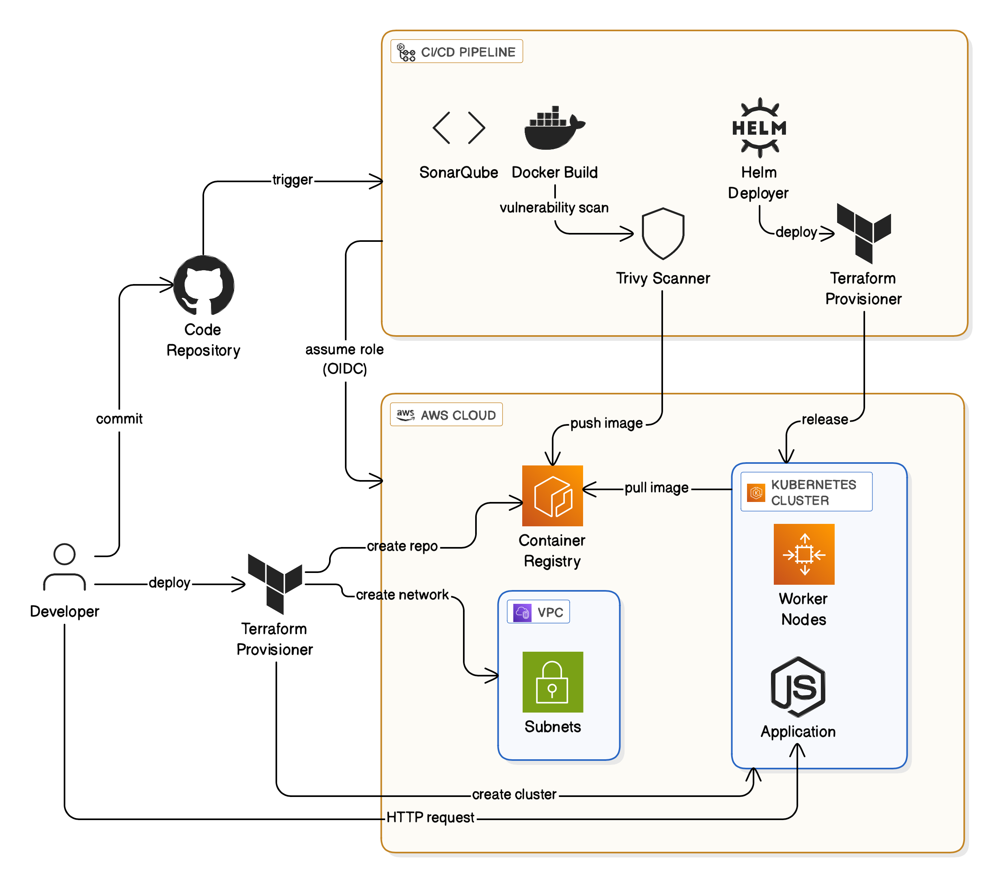

# DevSecOps AWS CI/CD & Infrastructure Project

This project implements a **complete DevSecOps pipeline** that provisions **AWS infrastructure (VPC, EKS, ECR)**, deploys a **Node.js application** using **Helm on EKS**, and integrates **CI/CD with GitHub Actions** for **secure, automated builds**.

The pipeline features:
- **Infrastructure as Code** with Terraform (modular structure)
- **CI/CD automation** with GitHub Actions and AWS OIDC
- **Security scanning** with SonarQube (code) and Trivy (container)
- **Helm-based Kubernetes deployment** on EKS

---

---

## Repository Layout

```
.
├── .github/workflows/               # CI/CD workflows for GitHub Actions
│   └── devsecops.yml                # Pipeline: build, scan, push, deploy
│
├── app_deploy/                      # Terraform root for app deployment
│   ├── build_role/                  # IAM role configuration for CI/CD
│   ├── helm_release/                # Helm release deployment module
│   ├── locals.tf
│   ├── main.tf                      # Orchestrates Helm deployment
│   ├── outputs.tf
│   ├── providers.tf
│   ├── terraform.auto.tfvars
│   └── variables.tf
│
├── helm/app/                        # Helm chart for Node.js application
│   ├── charts/
│   ├── templates/
│   │   ├── tests/
│   │   ├── _helpers.tpl
│   │   ├── deployment.yaml
│   │   ├── hpa.yaml
│   │   ├── ingress.yaml
│   │   ├── service.yaml
│   │   ├── serviceaccount.yaml
│   │   └── NOTES.txt
│   ├── Chart.yaml
│   └── values.yaml
│
├── infra/                           # Terraform root for core AWS infrastructure
│   ├── ecr/                         # ECR repository & lifecycle policy
│   │   ├── main.tf
│   │   ├── outputs.tf
│   │   └── variables.tf
│   ├── eks/                         # Amazon EKS cluster provisioning
│   │   ├── main.tf
│   │   ├── outputs.tf
│   │   └── variables.tf
│   ├── oidc/                        # GitHub OIDC IAM trust and policies
│   │   ├── main.tf
│   │   ├── outputs.tf
│   │   └── variables.tf
│   ├── policies/                    # JSON IAM and lifecycle policies
│   │   ├── ecr-lifecycle-policy.json
│   │   ├── github-permission-policy.json
│   │   └── github-trust-policy.json
│   ├── vpc/                         # VPC, subnets, NAT, route tables
│   │   ├── main.tf
│   │   ├── outputs.tf
│   │   └── variables.tf
│   ├── locals.tf
│   ├── main.tf                      # Entry point to provision all infra
│   ├── Makefile                     # Common automation commands
│   ├── outputs.tf
│   ├── providers.tf
│   ├── terraform.auto.tfvars
│   └── variables.tf
│
├── app.js                           # Node.js Express application
├── Dockerfile                       # Container build definition
├── package.json                     # App dependencies
├── package-lock.json
└── sonar-project.properties         # SonarQube configuration

```

---

## Features

1. **Infrastructure Provisioning (Terraform)**
   - Creates VPC with public/private subnets, NAT, route tables.
   - Provisions an **Amazon EKS cluster** (multi-AZ) for app workloads.
   - Configures **ECR** for container storage and lifecycle management.
   - Sets up **GitHub OIDC IAM roles** for secure, keyless CI/CD access.

2. **CI/CD Workflow (GitHub Actions)**
   - **OIDC authentication** to AWS (no static credentials).
   - Runs **SonarQube** for static code analysis.
   - Builds Docker image and **scans it with Trivy**.
   - Pushes the image to **ECR**.
   - Triggers **Terraform apply** to update the Helm release on EKS.

3. **Kubernetes Deployment (Helm)**
   - Deploys the Node.js app via Helm with configurable:
     - Replica count
     - Container image and tag
     - Resource requests/limits
     - Exposed port (default: `3000`)

4. **Security & Compliance**
   - **SonarQube** detects code vulnerabilities and bugs.
   - **Trivy** scans containers for CVEs before deployment.
   - **IAM least privilege** via scoped OIDC roles.

---

## Contributions

This project is open to enhancements and additional modules. Contributions are welcome for:

- **Blue-Green or Canary deployment strategies** for zero-downtime releases.
- **AWS WAF integration** for Layer 7 security.
- **CloudWatch Dashboards & Alarms** for real-time observability.
- **SSM-based diagnostics** for automated testing and troubleshooting across EC2/EKS resources.
- **SOC 2 / ISO 27001 compliance checks** using AWS Config and Security Hub.

To contribute:
1. Fork the repository.
2. Create a new branch: `git checkout -b feature/<your-feature>`.
3. Commit your changes: `git commit -m "Add <your-feature>"`.
4. Push and submit a pull request.

---

## Prerequisites

- [Terraform](https://developer.hashicorp.com/terraform/downloads) (v1.5+)
- [AWS CLI](https://aws.amazon.com/cli/)
- [kubectl](https://kubernetes.io/docs/tasks/tools/)
- [Helm](https://helm.sh/docs/intro/install/)
- [Docker](https://www.docker.com/)
- [GitHub CLI (`gh`)](https://cli.github.com/) (used by the Makefile to automatically create GitHub Actions secrets)
- **SonarCloud account**:
  1. Sign up at [SonarCloud](https://sonarcloud.io/).
  2. Create a project linked to your GitHub repo.
  3. Generate a **SonarCloud API token**.
  4. Add the token manually as a GitHub secret: `SONAR_TOKEN`.

> **Note:** All other secrets (`AWS_ROLE_TO_ASSUME`, `ECR_REPO_URL`, `EKS_CLUSTER`, etc.) are automatically set by the `Makefile` when you run `make deploy`.

---

## Setup & Deployment

### 1. Clone and Initialize

```bash
git clone https://github.com/<your-org>/devsecops-project.git
cd devsecops-project/infra
```
- Initialize using the Makefile (instead of manual terraform init)
- To create a new workspace (e.g., staging or production), you can modify the Makefile or run directly:
    - terraform workspace new staging
    - terraform workspace new production


### 2. Deploy Infrastructure
 Use the Makefile to deploy (wraps terraform apply)
```bash
make apply
```

### 3. Deploy Application

The CI/CD pipeline automatically:
1. Builds & scans Docker image.
2. Pushes to ECR.
3. Runs `terraform apply` to deploy the Helm release.

You can also manually deploy:

```bash
cd app_deploy
terraform apply -target=module.helm_release
```

---

## Pipeline Workflow

1. On push to `main`, the pipeline:
   - Installs Node.js dependencies.
   - Runs SonarQube scan.
   - Builds Docker image (`docker build`).
   - Scans image with Trivy.
   - Pushes image to ECR.
   - Runs Terraform to deploy/update app on EKS.

---

## Testing

1. Retrieve the EKS cluster context:
```bash
aws eks --region us-east-1 update-kubeconfig --name $(terraform output -raw eks_cluster_name)
kubectl get pods
```

2. Forward the service port (if no LoadBalancer):
```bash
kubectl port-forward svc/devsecops-app 8080:3000
curl http://localhost:8080
```

---

## Security Benefits

- **No long-lived AWS keys** (OIDC authentication).
- **Automated vulnerability checks** (Trivy).
- **Code quality enforcement** (SonarQube).
- **Immutable infrastructure** via Terraform.

---

## License

MIT License. See `LICENSE` for details.
